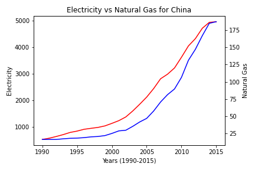
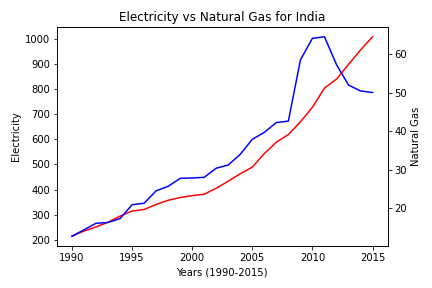

<p align="center">
  <a href="https://icons8.com/icons/set/carbon-dioxide"></a>
</p>

# Energy Consumption Analysis

[](http://forthebadge.com)
[](http://forthebadge.com)

An engineering analysis of energy consumption in the world, with particular emphasis on potential impact on the levels of carbon dioxide distributed in the atmosphere, completed as a group project for ENGR 102 in Fall 2018. 

## Table of Contents

- [About](#about)
  - [Program](#program)
  - [Results](#results)
- [Data Files](#data-files)

## About

### Program

The program primarily uses for loops to iterate through the text data files vertically and horizontally. The data is put into lists and arrays for plotting purposes towards the end of the code. The code is separated into portions for each set of graphs, and can be indentified by the header comments prior to the block(s) of code. Here is an example of the whole process of reading from the EnergyRawDataFinal.txt to graphing the energy types:

```
data1 = open("EnergyRawDataFinal.txt")
header = data1.readline()

countrydata=[]

linecount = 0
for line in data1:
    linecount += 1
    linedata = line.split(",")
    countrydata.append(linedata)

energytype = []
for i in range(len(countries)):
    j = 1
    while j < len(countrydata):
        if countrydata[j][0] == countries[i]:
            energytype.append([int(countrydata[j-1][3]),float(countrydata[j-1][1]),float(countrydata[j][1])])
        j+=2

tracker = 0
for i in range(len(countries)):
    electricity = []
    natural_gas = []
    for j in range(26):
        electricity.append(energytype[j+tracker][1])
        natural_gas.append(energytype[j+tracker][2])
    tracker += 26
    fig, ax1 = plt.subplots()
    ax1.plot(years_data,electricity, 'r-')
    ax1.set_xlabel('Years (1990-2015)')
    ax1.set_ylabel('Electricity')
    ax2 = ax1.twinx()
    ax2.plot(years_data,natural_gas, 'b-')
    ax2.set_ylabel('Natural Gas')
    plt.title('Electricity vs Natural Gas for %s' %(countries[i]))
    fig.tight_layout()
    #plt.savefig('Electricity_NaturalGas_' + countries[i] + '.png')
    plt.show()

data1.close()
```

### Results

Since there are a lot of image, I don't want to paste all of them here. They can be viewed in the Output_Images folder. Since the code for energy types was displayed above as an example, let's see graphs of that for the United States, China, and India (3 largely populated countries). 

  

## Data Files

The files were provided beforehand to perform the analysis. It is assumed the statistics are true (thought they may not be) in terms of this project.

- CarbonEmissions.txt: Contains the carbon emissions of each country.
- EnergyConsumers.txt: Contains the energy consumption by year.
- EnergyRawDataFinal.txt: Contains electricity and natural gas data.
